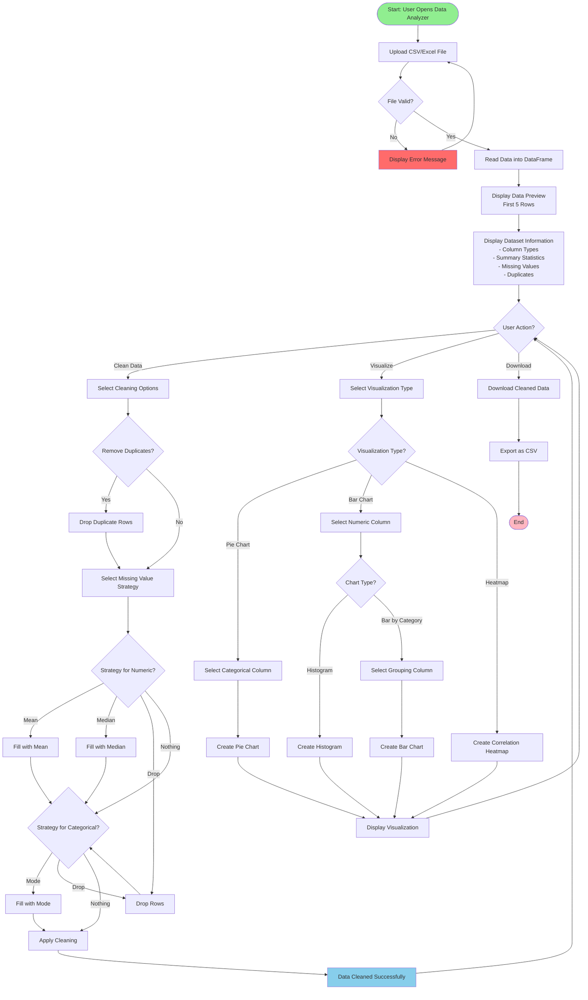
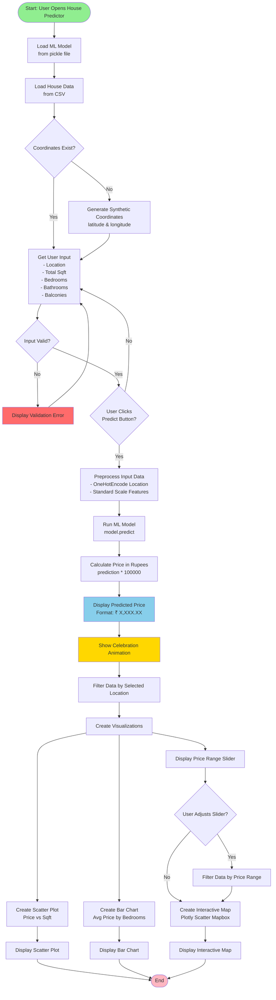
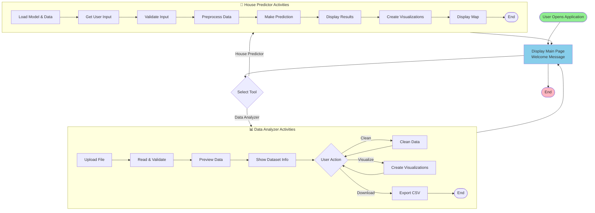
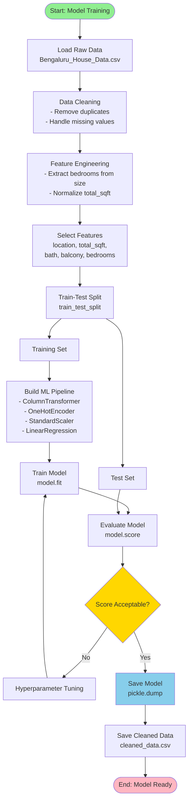
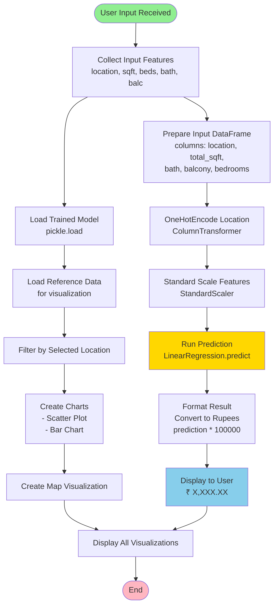
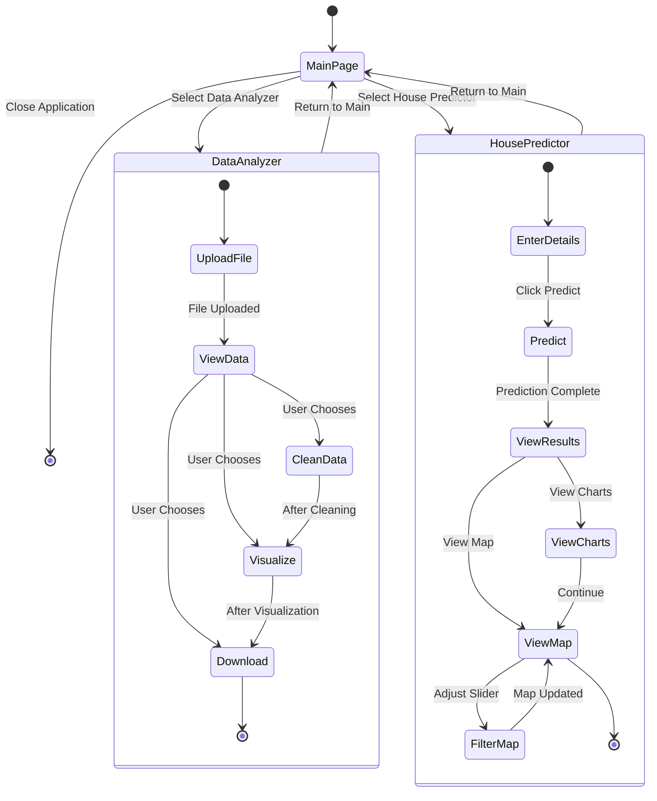
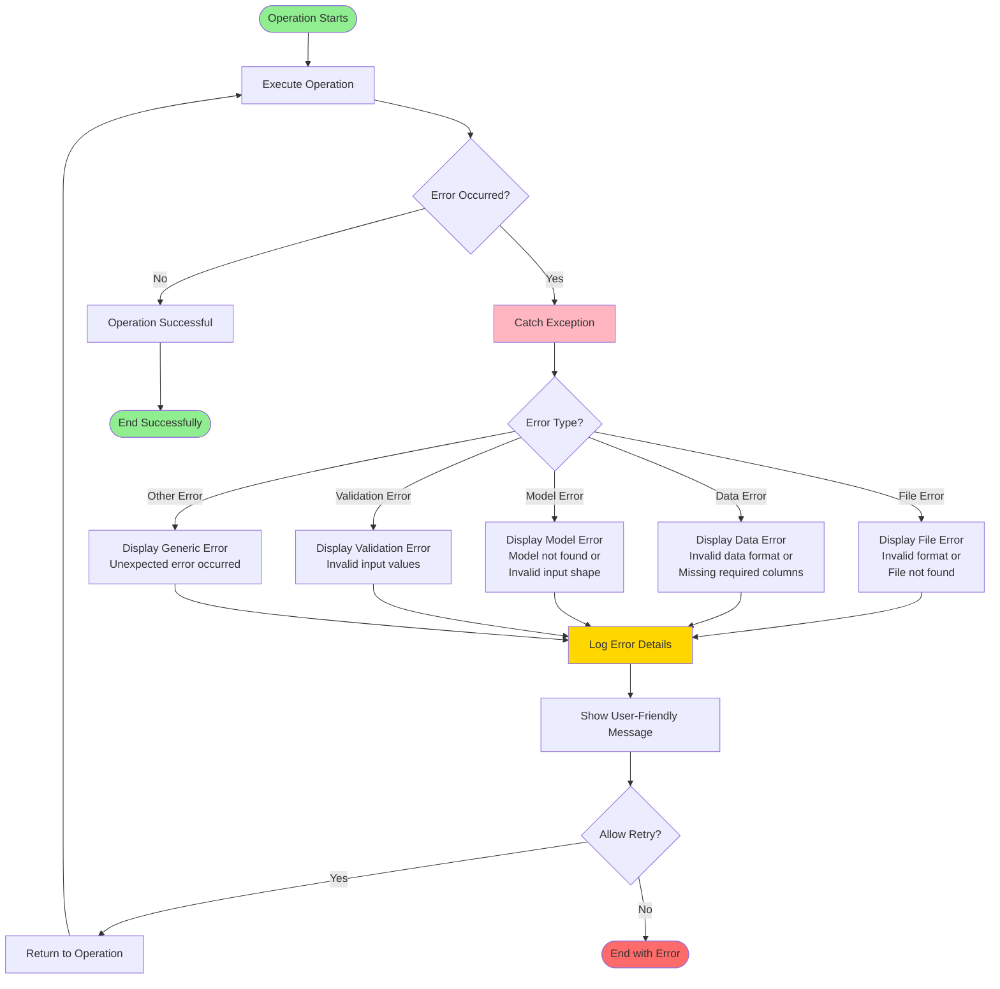

# Activity Diagram - House Price Prediction Project

## Activity Diagram: Data Analyzer Workflow

## Activity Diagram: House Price Prediction Workflow

## Activity Diagram: Complete Application Flow

## Activity Diagram: Machine Learning Model Training Process

## Activity Diagram: Data Processing Pipeline

```mermaid
flowchart LR
    Start([Input Data]) --> CheckFormat{File Format?}
    CheckFormat -->|CSV| ReadCSV[pandas.read_csv]
    CheckFormat -->|Excel| ReadExcel[pandas.read_excel]
    
    ReadCSV --> Analyze[Analyze Structure]
    ReadExcel --> Analyze
    
    Analyze --> IdentifyTypes[Identify Column Types<br/>Numeric vs Categorical]
    IdentifyTypes --> CheckQuality[Check Data Quality<br/>- Missing values<br/>- Duplicates<br/>- Outliers]
    
    CheckQuality --> Clean[Apply Cleaning<br/>- Fill missing<br/>- Remove duplicates<br/>- Handle outliers]
    Clean --> Transform[Transform Data<br/>- Encode categorical<br/>- Scale numeric]
    Transform --> Validate[Validate Cleaned Data]
    Validate --> Export[Export Cleaned Data]
    Export --> End([Output Data])
    
    style Start fill:#90EE90
    style End fill:#FFB6C1
    style Clean fill:#87CEEB
    style Transform fill:#FFD700
```

## Activity Diagram: Prediction Process (Detailed)

## Activity Diagram: User Interaction Flow

## Activity Diagram: Error Handling Flow

## Activity Diagram Notes

### Key Activities

1. **Data Analyzer Activities**:
   - File upload and validation
   - Data preview and analysis
   - Data cleaning operations
   - Visualization creation
   - Data export

2. **House Predictor Activities**:
   - Model and data loading
   - User input collection
   - Data preprocessing
   - Price prediction
   - Result visualization

3. **Common Activities**:
   - Error handling
   - User validation
   - Data transformation
   - Visualization rendering

### Decision Points

- File validation checks
- User action selections
- Data quality checks
- Model performance evaluation
- Input validation

### Parallel Activities

- Multiple visualizations can be created simultaneously
- Data loading and model loading can occur in parallel
- Chart creation and map creation are independent

### Swimlanes

The activities can be organized into swimlanes:
- **User Interface Layer**: User interactions
- **Application Layer**: Business logic
- **Processing Layer**: Data processing
- **ML Layer**: Model operations
- **Storage Layer**: Data persistence

