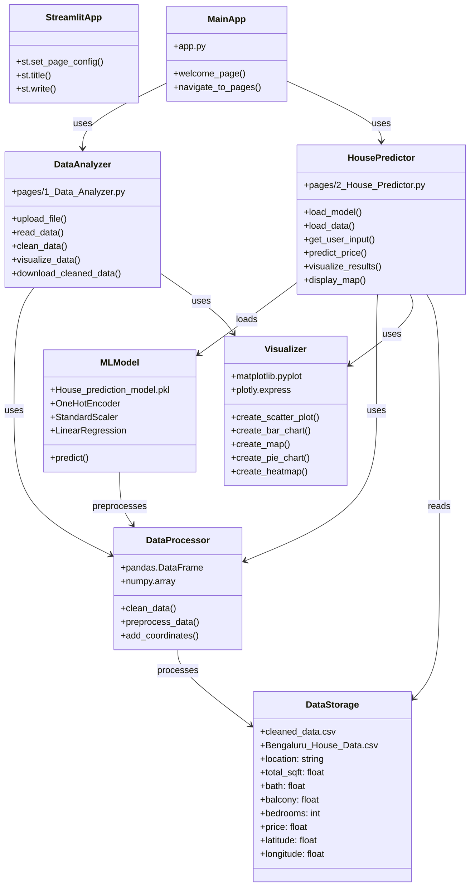

# Class Diagram - House Price Prediction Project

## Module Structure

### Main Application (`app.py`)
- Entry point of the Streamlit application
- Provides navigation to different tools

### Data Analyzer Module (`pages/1_Data_Analyzer.py`)
- **Functions:**
  - File upload handling (CSV/Excel)
  - Data reading and preview
  - Data cleaning (duplicates, missing values)
  - Data visualization (pie charts, bar charts, heatmaps)
  - Data export functionality

### House Predictor Module (`pages/2_House_Predictor.py`)
- **Functions:**
  - Model loading from pickle file
  - Data loading from CSV
  - User input collection
  - Price prediction
  - Result visualization
  - Interactive map display

### Machine Learning Pipeline
- **Components:**
  - ColumnTransformer (OneHotEncoder for location)
  - StandardScaler (feature scaling)
  - LinearRegression (prediction model)

### Data Processing
- Pandas for data manipulation
- NumPy for numerical operations
- Data cleaning and preprocessing

### Visualization
- Matplotlib for static plots
- Plotly for interactive visualizations
- Map visualization with geographic data

