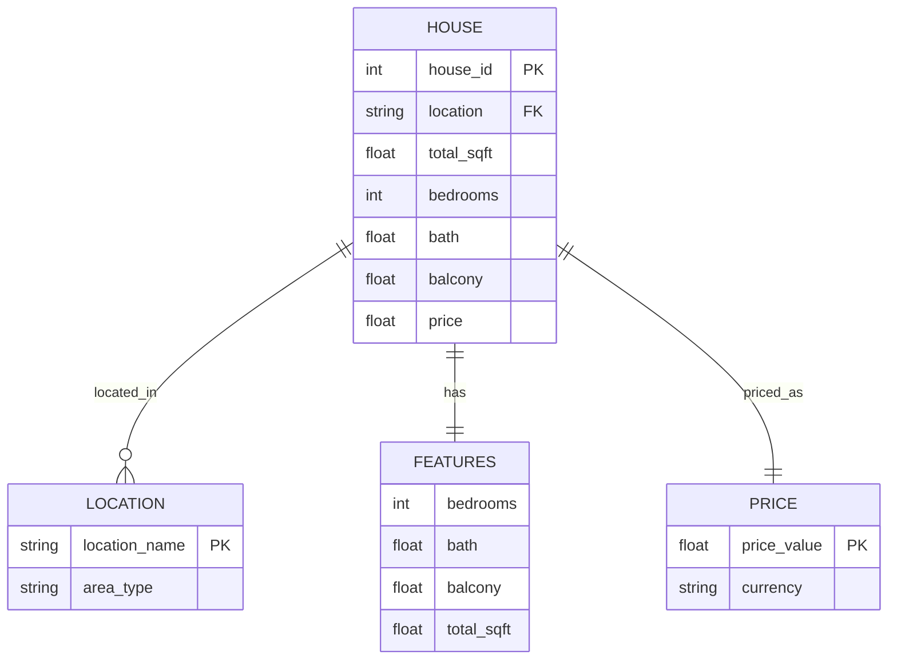

# ER Diagram - House Price Prediction Project



## Entity Descriptions

### HOUSE (Main Entity)
- **Primary Key:** house_id (implicit index)
- **Attributes:**
  - `location` (string): Location name in Bangalore
  - `total_sqft` (float): Total square footage of the house
  - `bedrooms` (int): Number of bedrooms
  - `bath` (float): Number of bathrooms
  - `balcony` (float): Number of balconies
  - `price` (float): Price in Lakhs (₹)

### LOCATION
- **Primary Key:** location_name
- **Attributes:** area_type (Super built-up, Plot, Built-up, etc.)

### Relationships
- **HOUSE → LOCATION:** Many houses share one location.
- **HOUSE → FEATURES:** Feature set belongs to a house record.
- **HOUSE → PRICE:** Each house has one price entry.

## Data Model Structure

### CSV Schema (cleaned_data.csv)
```
location, total_sqft, bath, balcony, price, bedrooms
```

### Feature Engineering
- **Categorical:** location (One-Hot Encoded)
- **Numerical:** total_sqft, bath, balcony, bedrooms (Standard Scaled)
- **Target:** price (in Lakhs ₹)


