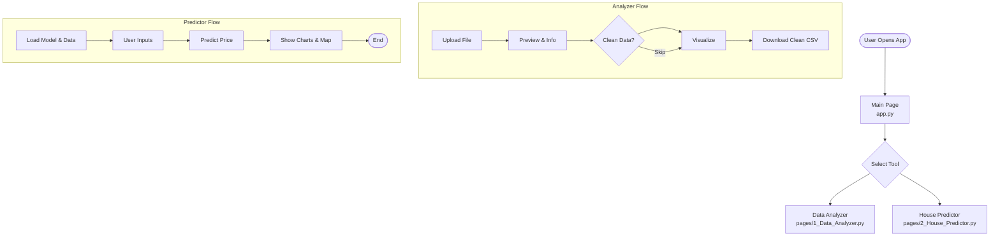
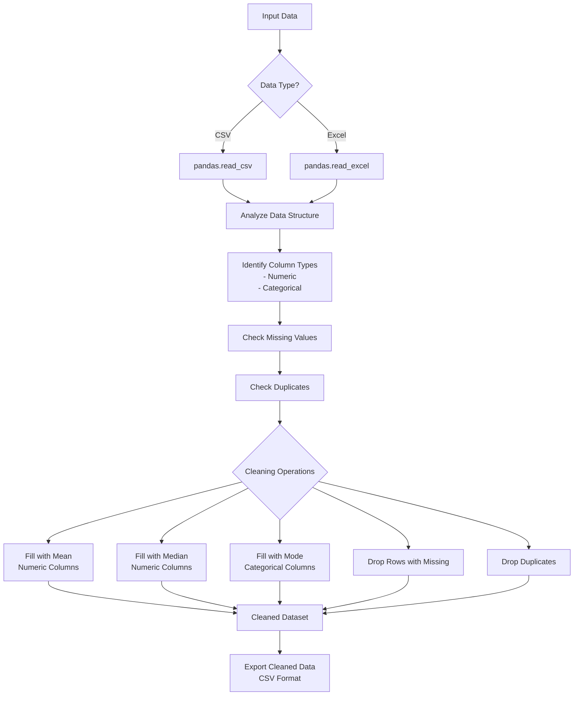
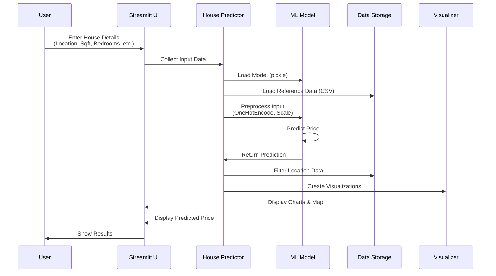
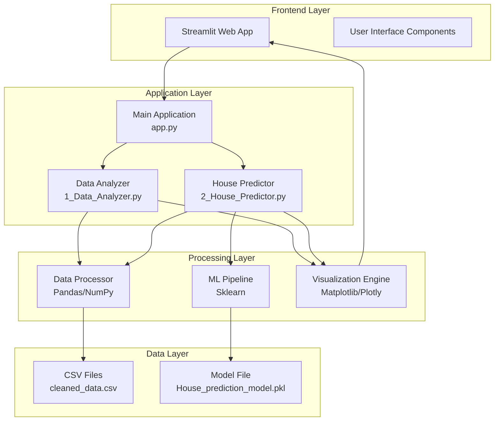

# Flow Diagram - House Price Prediction Project

## Application Flow Diagram

```mermaid
flowchart TD
    Start([User Opens App]) --> MainPage[Main Page<br/>app.py]
    MainPage --> Choice{Select Tool}
    Choice --> DataAnalyzer[Data Analyzer<br/>pages/1_Data_Analyzer.py]
    Choice --> HousePredictor[House Predictor<br/>pages/2_House_Predictor.py]

    subgraph Analyzer Flow
        Upload[Upload File] --> Preview[Preview & Info]
        Preview --> Clean{Clean Data?}
        Clean --> Visualize[Visualize]
        Visualize --> Download[Download Clean CSV]
        Clean -->|Skip| Visualize
    end

    subgraph Predictor Flow
        LoadModel[Load Model & Data] --> Input[User Inputs]
        Input --> Predict[Predict Price]
        Predict --> Viz[Show Charts & Map]
        Viz --> End([End])
    end
```

## Machine Learning Pipeline Flow

```mermaid
flowchart LR
    RawData[Raw House Data<br/>Bengaluru_House_Data.csv] --> DataCleaning[Data Cleaning<br/>- Remove duplicates<br/>- Handle missing values<br/>- Feature extraction]
    DataCleaning --> FeatureEng[Feature Engineering<br/>- Extract bedrooms from size<br/>- Normalize total_sqft<br/>- Handle categorical location]
    FeatureEng --> SplitData[Train-Test Split<br/>train_test_split]
    SplitData --> TrainSet[Training Set]
    SplitData --> TestSet[Test Set]
    TrainSet --> Preprocessing[Preprocessing Pipeline<br/>- OneHotEncoder: location<br/>- StandardScaler: numeric features]
    Preprocessing --> ModelTraining[Train Linear Regression<br/>model.fit]
    ModelTraining --> ModelEval[Model Evaluation<br/>R² Score: 0.695]
    ModelEval --> SaveModel[Save Model<br/>pickle.dump]
    SaveModel --> ModelFile[House_prediction_model.pkl]
    ModelFile --> Production[Production Use<br/>Load & Predict]
```

## Data Processing Flow

```mermaid
flowchart TD
    InputData[Input Data] --> CheckType{Data Type?}
    CheckType -->|CSV| ReadCSV[pandas.read_csv]
    CheckType -->|Excel| ReadExcel[pandas.read_excel]
    ReadCSV --> Analyze[Analyze Data Structure]
    ReadExcel --> Analyze
    Analyze --> IdentifyCols[Identify Column Types<br/>- Numeric<br/>- Categorical]
    IdentifyCols --> CheckMissing[Check Missing Values]
    CheckMissing --> CheckDup[Check Duplicates]
    CheckDup --> CleanOps{Cleaning Operations}
    CleanOps --> FillMean[Fill with Mean<br/>Numeric Columns]
    CleanOps --> FillMedian[Fill with Median<br/>Numeric Columns]
    CleanOps --> FillMode[Fill with Mode<br/>Categorical Columns]
    CleanOps --> DropRows[Drop Rows with Missing]
    CleanOps --> DropDup[Drop Duplicates]
    FillMean --> CleanData[Cleaned Dataset]
    FillMedian --> CleanData
    FillMode --> CleanData
    DropRows --> CleanData
    DropDup --> CleanData
    CleanData --> Export[Export Cleaned Data<br/>CSV Format]
```

## Prediction Flow

```mermaid
sequenceDiagram
    participant User
    participant UI as Streamlit UI
    participant Predictor as House Predictor
    participant Model as ML Model
    participant Data as Data Storage
    participant Viz as Visualizer
    
    User->>UI: Enter House Details<br/>(Location, Sqft, Bedrooms, etc.)
    UI->>Predictor: Collect Input Data
    Predictor->>Model: Load Model (pickle)
    Predictor->>Data: Load Reference Data (CSV)
    Predictor->>Model: Preprocess Input<br/>(OneHotEncode, Scale)
    Model->>Model: Predict Price
    Model->>Predictor: Return Prediction
    Predictor->>Data: Filter Location Data
    Predictor->>Viz: Create Visualizations
    Viz->>UI: Display Charts & Map
    Predictor->>UI: Display Predicted Price
    UI->>User: Show Results
```

## System Architecture Flow

```mermaid
graph TB
    subgraph "Frontend Layer"
        Streamlit[Streamlit Web App]
        UI[User Interface Components]
    end
    
    subgraph "Application Layer"
        MainApp[Main Application<br/>app.py]
        DataAnalyzer[Data Analyzer<br/>1_Data_Analyzer.py]
        HousePredictor[House Predictor<br/>2_House_Predictor.py]
    end
    
    subgraph "Processing Layer"
        DataProcessor[Data Processor<br/>Pandas/NumPy]
        MLPipeline[ML Pipeline<br/>Sklearn]
        Visualizer[Visualization Engine<br/>Matplotlib/Plotly]
    end
    
    subgraph "Data Layer"
        CSVData[CSV Files<br/>cleaned_data.csv]
        ModelFile[Model File<br/>House_prediction_model.pkl]
    end
    
    Streamlit --> MainApp
    MainApp --> DataAnalyzer
    MainApp --> HousePredictor
    DataAnalyzer --> DataProcessor
    DataAnalyzer --> Visualizer
    HousePredictor --> MLPipeline
    HousePredictor --> DataProcessor
    HousePredictor --> Visualizer
    DataProcessor --> CSVData
    MLPipeline --> ModelFile
    Visualizer --> Streamlit
```

