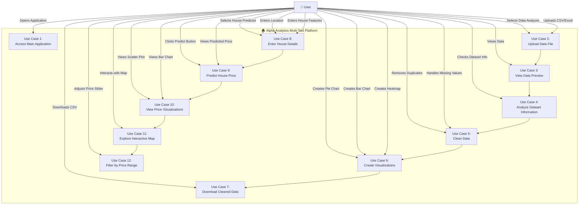
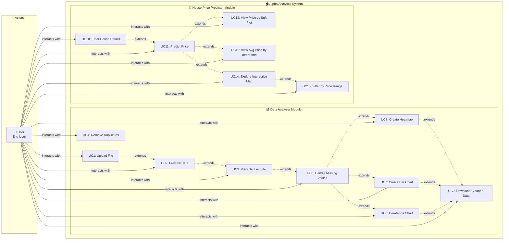

# Use Case Diagram - House Price Prediction Project

## Detailed Use Case Diagram (UML Style)

## Use Case Descriptions

### Data Analyzer Module

#### UC1: Upload File
- **Actor**: User
- **Description**: User uploads a CSV or Excel file for analysis
- **Preconditions**: User has access to the application
- **Postconditions**: File is loaded into the system
- **Main Flow**: 
  1. User clicks file uploader
  2. User selects CSV/Excel file
  3. System validates file format
  4. System loads file into memory

#### UC2: Preview Data
- **Actor**: User
- **Description**: User views first 5 rows of uploaded data
- **Preconditions**: File has been uploaded (UC1)
- **Postconditions**: Data preview is displayed

#### UC3: View Dataset Information
- **Actor**: User
- **Description**: User views column types, summary statistics, missing values, and duplicates
- **Preconditions**: File has been uploaded (UC1)
- **Postconditions**: Dataset information is displayed

#### UC4: Remove Duplicates
- **Actor**: User
- **Description**: User removes duplicate rows from dataset
- **Preconditions**: Data has been loaded (UC1)
- **Postconditions**: Duplicate rows are removed

#### UC5: Handle Missing Values
- **Actor**: User
- **Description**: User handles missing values using selected strategy (Mean/Median/Mode/Drop)
- **Preconditions**: Data has been loaded (UC1)
- **Postconditions**: Missing values are handled according to strategy

#### UC6: Create Pie Chart
- **Actor**: User
- **Description**: User creates a pie chart for categorical column
- **Preconditions**: Data has been loaded (UC1)
- **Postconditions**: Pie chart is displayed

#### UC7: Create Bar Chart
- **Actor**: User
- **Description**: User creates bar chart or histogram for numeric column
- **Preconditions**: Data has been loaded (UC1)
- **Postconditions**: Bar chart/histogram is displayed

#### UC8: Create Heatmap
- **Actor**: User
- **Description**: User creates correlation heatmap for numeric columns
- **Preconditions**: Data has been loaded (UC1)
- **Postconditions**: Correlation heatmap is displayed

#### UC9: Download Cleaned Data
- **Actor**: User
- **Description**: User downloads cleaned dataset as CSV
- **Preconditions**: Data has been processed (UC4 or UC5)
- **Postconditions**: CSV file is downloaded

### House Price Predictor Module

#### UC10: Enter House Details
- **Actor**: User
- **Description**: User enters house location, area, bedrooms, bathrooms, and balconies
- **Preconditions**: User has access to House Predictor module
- **Postconditions**: Input data is collected

#### UC11: Predict Price
- **Actor**: User
- **Description**: System predicts house price based on user input using ML model
- **Preconditions**: User has entered house details (UC10)
- **Postconditions**: Predicted price is displayed
- **Main Flow**:
  1. User clicks "Predict Price" button
  2. System loads ML model
  3. System preprocesses input data
  4. System makes prediction
  5. System displays predicted price

#### UC12: View Price vs Sqft Plot
- **Actor**: User
- **Description**: User views scatter plot showing price vs square feet for selected location
- **Preconditions**: Price has been predicted (UC11)
- **Postconditions**: Scatter plot is displayed

#### UC13: View Avg Price by Bedrooms
- **Actor**: User
- **Description**: User views bar chart showing average price by number of bedrooms
- **Preconditions**: Price has been predicted (UC11)
- **Postconditions**: Bar chart is displayed

#### UC14: Explore Interactive Map
- **Actor**: User
- **Description**: User explores interactive map showing house prices across Bangalore
- **Preconditions**: Price has been predicted (UC11)
- **Postconditions**: Interactive map is displayed

#### UC15: Filter by Price Range
- **Actor**: User
- **Description**: User filters map data by adjusting price range slider
- **Preconditions**: Interactive map is displayed (UC14)
- **Postconditions**: Map is filtered by price range

## Use Case Relationships

### Include Relationships
- UC2 includes UC1 (Preview requires Upload)
- UC3 includes UC1 (Dataset Info requires Upload)
- UC6, UC7, UC8 include UC1 (Visualizations require Upload)
- UC12, UC13, UC14 include UC11 (Visualizations require Prediction)

### Extend Relationships
- UC9 extends UC6, UC7, UC8 (Download extends Visualizations)
- UC15 extends UC14 (Price Filter extends Map)

### Generalization
- All use cases are initiated by the User actor
- Use cases are grouped into two main modules: Data Analyzer and House Predictor

